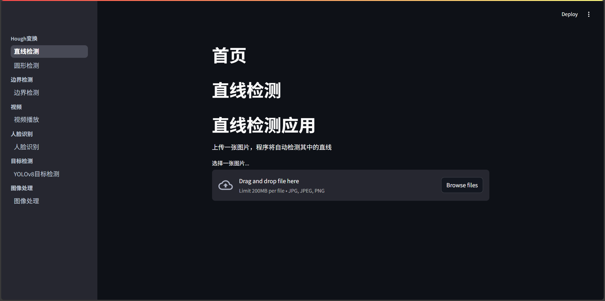
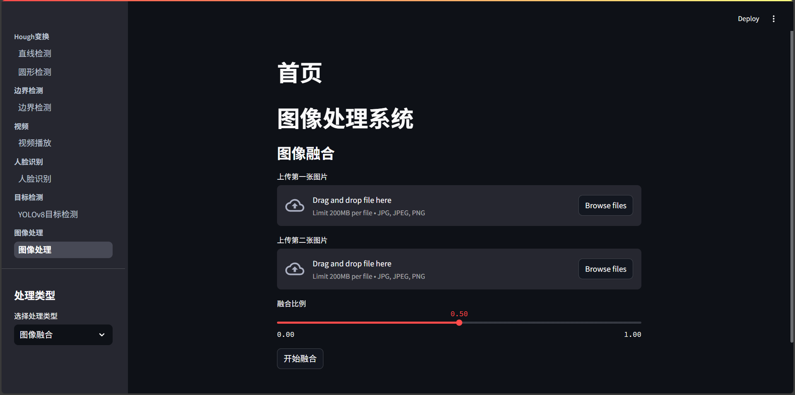
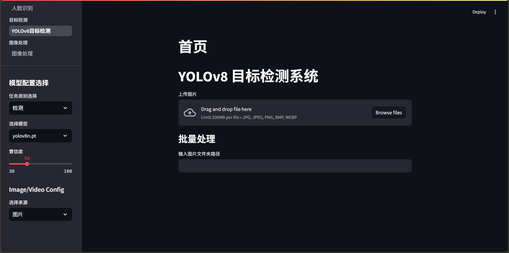
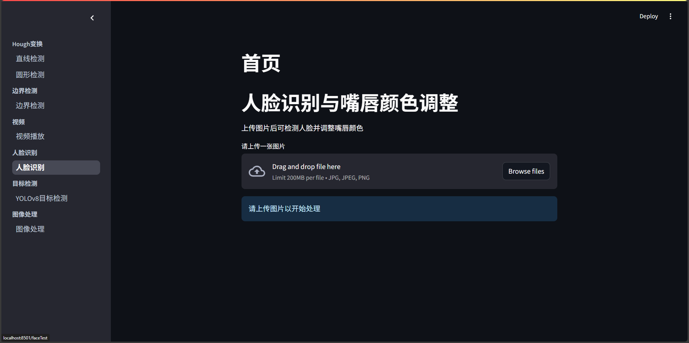

# 图像处理系统


这是一个基于 Streamlit 开发的综合性图像处理系统，集成了多种图像处理功能，包括目标检测、图像处理、人脸处理等。系统提供了友好的图形界面，支持实时处理和批量处理。

## 功能特点

### 1. 图像处理
- 图像融合：支持两张图片的加权融合
- 图像增强：支持亮度和对比度调整
- 图像滤波：支持高斯滤波、中值滤波、均值滤波
- 图像分割：支持阈值分割
- OCR文字识别：支持中英文识别，支持图像预处理

### 2. 目标检测（YOLOv8）
- 支持检测/分割/关键点三种任务
- 支持图片/视频/摄像头输入
- 可配置置信度阈值
- 支持多种预训练模型
- 实时显示检测结果和统计信息

### 3. 人脸处理
- 人脸检测：支持多个人脸同时检测
- 唇色调整：支持实时调整唇色
- 实时视频处理：支持摄像头实时处理

## 界面预览

### 主界面


### 图像处理界面


### 目标检测界面


### 人脸处理界面


## 环境要求

- Python 3.8+
- CUDA 11.8+ (用于GPU加速，可选)
- Tesseract-OCR (用于OCR功能)

## 环境配置

1. 创建并激活虚拟环境：
```bash
conda create -n image python=3.8
conda activate image
```

2. 安装依赖包：
```bash
pip install -r requirements.txt
```

3. 安装 Tesseract-OCR：
- Windows: 从 https://github.com/UB-Mannheim/tesseract/wiki 下载安装
- 安装时请确保选中"Additional language data (download)"以支持中文识别
- 将 Tesseract 安装路径添加到系统环境变量 PATH 中

## 项目结构

```
├── Page/                    # 页面模块
│   ├── image_process_page.py  # 图像处理页面
│   ├── yolo_page.py          # YOLO检测页面
│   ├── face_lip_adjust.py    # 人脸唇色调整
│   └── ...
├── utils.py                 # 工具函数
├── config.py               # 配置文件
├── requirements.txt        # 依赖包列表
└── README.md              # 项目说明
```

## 使用方法

1. 启动应用：
```bash
streamlit run index.py
```

2. 在浏览器中访问：
```
http://localhost:8501
```

3. 使用说明：

### 图像处理
1. 选择处理类型（融合/增强/滤波/分割/OCR）
2. 上传图片或选择输入源
3. 调整处理参数
4. 点击处理按钮
5. 查看结果并保存

### 目标检测
1. 选择任务类型（检测/分割/关键点）
2. 选择预训练模型
3. 设置置信度阈值
4. 选择输入源（图片/视频/摄像头）
5. 开始检测并查看结果

### 人脸处理
1. 上传图片或使用摄像头
2. 选择处理功能
3. 调整参数
4. 实时查看效果

## 注意事项

1. 首次运行时需要下载预训练模型，请确保网络连接正常
2. 使用摄像头功能时，请确保设备已正确连接
3. OCR功能需要正确安装 Tesseract-OCR 和中文语言包
4. 建议使用 GPU 进行目标检测，可以显著提升处理速度

## 常见问题

### 1. Tesseract 相关错误
- 检查 Tesseract 是否正确安装
- 确认中文语言包是否已下载
- 验证环境变量是否正确设置

### 2. CUDA 相关错误
- 检查 CUDA 版本是否兼容
- 确认 PyTorch 版本是否支持当前 CUDA 版本

### 3. 摄像头访问错误
- 检查摄像头是否被其他程序占用
- 确认摄像头驱动是否正确安装

## 依赖包列表

主要依赖包：
- streamlit>=1.24.0
- opencv-python>=4.7.0
- torch>=2.0.0
- ultralytics>=8.0.0
- face-recognition>=1.3.0
- pytesseract>=0.3.10
- numpy>=1.24.0
- pillow>=9.0.0
- plotly>=5.13.0
- pandas>=1.5.0
- dlib>=19.24.0

详细依赖请参考 requirements.txt

## 更新日志

### v1.0.0 (2024-03-xx)
- 初始版本发布
- 实现基础图像处理功能
- 集成 YOLOv8 目标检测
- 添加人脸处理功能
- 支持 OCR 文字识别

## 贡献指南

1. Fork 本仓库
2. 创建你的特性分支 (`git checkout -b feature/AmazingFeature`)
3. 提交你的更改 (`git commit -m 'Add some AmazingFeature'`)
4. 推送到分支 (`git push origin feature/AmazingFeature`)
5. 开启一个 Pull Request

## 许可证

MIT License

## 联系方式

如有问题或建议，请提交 Issue 或 Pull Request。 